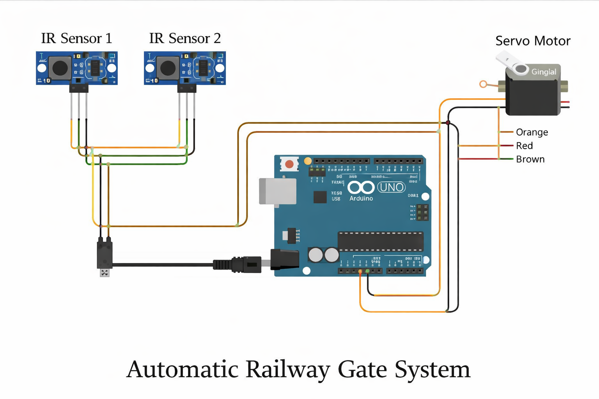

## ⚙️ Features
- Real-time train detection using IR sensors  
- Automatic gate control using servo motor  
- Reduces human error and improves safety  

## 🔌 Circuit Connections
- IR Sensor 1 → Pin 2  
- IR Sensor 2 → Pin 3  
- Servo Motor → Pin 9  
- VCC → 5V  
- GND → GND  

## ⚙️ Working Principle
When IR sensors detect a train, the Arduino sends a signal to the servo motor to close the gate. Once the train passes, the gate opens automatically. 

## 📷 Circuit Diagram

## 📷 Project Model

## 💻 Code
The Arduino code is available in: railway_gate.ino

## 🎥 Demo

This video demonstrates the real-time working of the automatic railway gate system:
(https://www.linkedin.com/posts/kushwahapawan527_the-automatic-railway-gate-system-is-a-safety-focused-activity-7339550669491585024-t45b?utm_source=share&utm_medium=member_desktop&rcm=ACoAAFDvl2kB6PRtyj4xUWG4RrN098KB23CkRwY)
